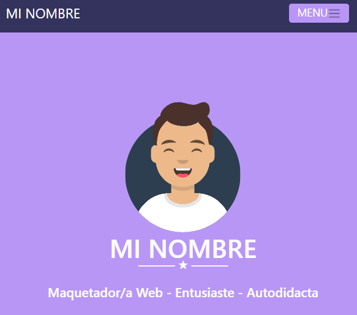

<h2>🌟Portfólio MI NOMBRE </h2>

Este é um portfólio web com linguagem em espanhol e design feito pela <a href="https://www.digitalhouse.com/br/">**Digital House❤**</a>.  O projeto é composto por uma parte principal com nome e imagem, portfólio de atividades com modal, área Sobre mim com descrição pessoal e campo de contato para o envio de mensagens. Além disso possui no footer algumas descrições do programador e meios de contato.

###### (header e main)

------

<h2>📌O que foi feito aqui?</h2>

* A base do projeto é feita em HTML e CSS no Visual Studio Code.
* Para escrever o CSS foi usado SASS.
* O Tongue e Modal foram feitos com BOOTSTRAP assim como a responsividade. 

------

<h2>Softwares e linguagens usados 💾<h2>  

###    

------

<h2>Redes📨</h2> 

###                                            

